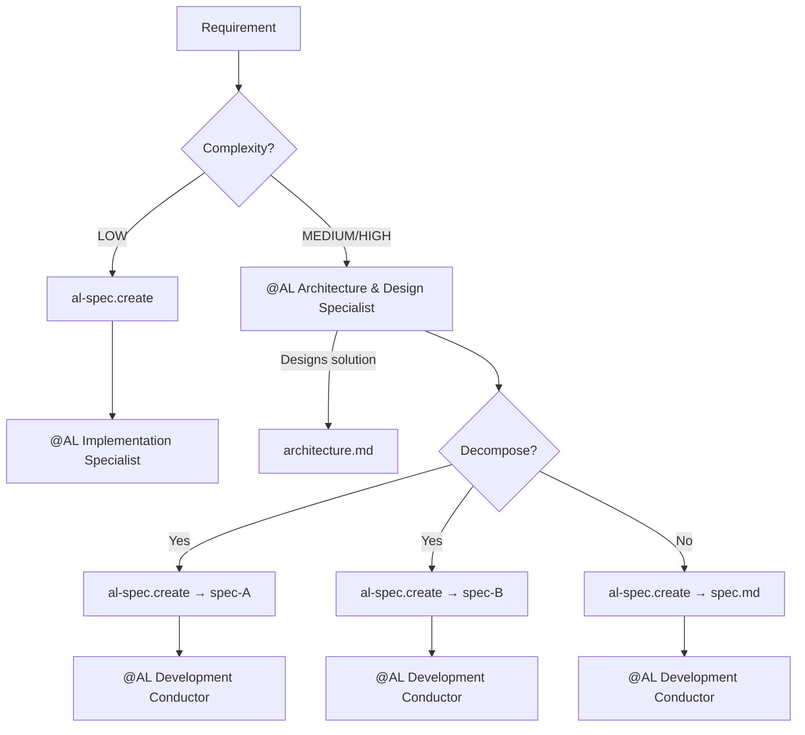
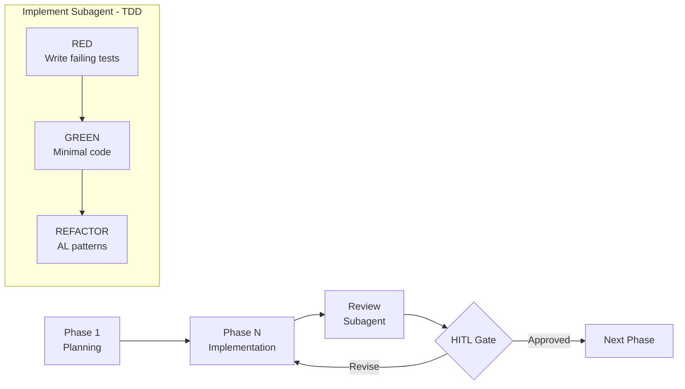
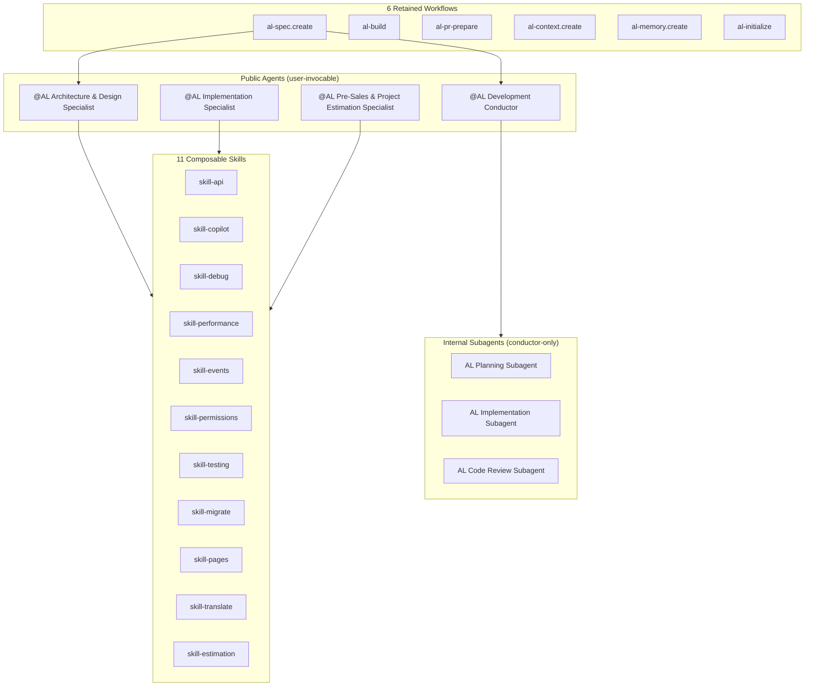

<div align="center">


# ALDC — AL Agentic Engineering System

**Skills-based, spec-driven, TDD-orchestrated development framework for Microsoft Dynamics 365 Business Central.**

_Engineering systems, visibly reasoned._

[](docs/framework/ALDC-Core-Spec-v1.2.md)
[](CHANGELOG.md)
[](claude-plugin/)
[](https://danielmeppiel.github.io/awesome-ai-native/)
[](./LICENSE)
[](https://github.com/javiarmesto/AL-Development-Collection-for-GitHub-Copilot/issues)
[](https://github.com/javiarmesto/AL-Development-Collection-for-GitHub-Copilot/stargazers)

</div>

> [!IMPORTANT]
> **Now available for both GitHub Copilot and Claude Code.** ALDC is under active development against **Core Spec v1.2**, with conformance enforced in CI. See [What's New](#whats-new) for the latest release.

---

## Why ALDC?

AI accelerates AL development — but raw code generation is unpredictable, hard to review, and easy to get wrong against Business Central's extension rules. ALDC adds the engineering discipline around it.

| Without ALDC | With ALDC |
| --- | --- |
| Ad-hoc, one-shot code generation | **Contract-driven** development (spec → architecture → test-plan → code) |
| No checkpoints — you find out at the end | **Human-in-the-loop gates** at every phase |
| Tests written last (or never) | **TDD-orchestrated** — tests FIRST, then code |
| Base-app edits sneak in | **Extension-only** by construction |
| "Looks fine to me" reviews | **Cited reviews & audits** against BC knowledge |

---

## What is ALDC?

ALDC (AL Development Collection) transforms how you develop Business Central extensions. Instead of ad-hoc code generation, it provides **structured, contract-driven development** with specialized agents, composable skills, and human-in-the-loop gates — the same framework working natively across two platforms:

- **GitHub Copilot** — Agents, skills, prompts, and instructions in `.github/` and `agents/`
- **Claude Code** — Agents, skills, rules, and hooks in `.claude/` + official plugin in `claude-plugin/`

---

## Installation

### GitHub Copilot

Install from the VS Code Marketplace or:

```bash
code --install-extension JavierArmesto.aldc-al-development-collection
```

Then, from the Command Palette:

- `AL Collection: Install Toolkit to Workspace` — copies the framework into your project's `.github/`
- `AL Collection: Update Toolkit` — merges a new version, preserving your customizations
- `AL Collection: Validate Installation` — verifies compliance

### GitHub Copilot (Plugin Marketplace)

ALDC also ships as an installable Copilot plugin — `plugin.json` declares the agents (`agents/`), skills (`skills/`), and prompts (`prompts/`) that get installed, for editors that support the Copilot plugin marketplace:

```bash
copilot plugin marketplace add javiarmesto/ALDC-AL-Development-Collection
copilot plugin install aldc@aldc-marketplace
```

The agents, skills, and prompts are installed under your Copilot plugins folder and become available immediately, no `.github/` copy step required.

### Claude Code (Plugin)

```bash
/plugin install aldc
/aldc:al-initialize
```

`al-initialize` copies path-scoped rules to `.claude/rules/`, generates a project `CLAUDE.md`, and configures the workspace.

### Claude Code (Direct)

Clone this repo and open it with Claude Code. The `.claude/` directory and `CLAUDE.md` are detected automatically.

---

## Quick Start

### GitHub Copilot

1. Install the extension and open your AL project
2. Run `AL Collection: Install Toolkit to Workspace`
3. Start with `@workspace use al-spec.create` plus your requirement
4. Follow the guided flow

### Claude Code

1. `/plugin install aldc`
2. `/aldc:al-initialize`
3. Call any agent: `@al-architect`, `@al-developer`, `@al-conductor`, `@al-presales`
4. Or run a workflow: `/aldc:al-spec-create`

See [QUICKSTART.md](docs/framework/QUICKSTART.md) for the full onboarding guide.

---

## Key Features

### 🤖 4 Public Agents — one specialist per development phase

| Agent | Role |
| --- | --- |
| `@AL Architecture & Design Specialist` | Designs solutions, information flows, technical decisions |
| `@AL Implementation Specialist` | Implements, debugs, quick adjustments |
| `@AL Development Conductor` | Orchestrates TDD implementation with subagents |
| `@AL Pre-Sales & Project Estimation Specialist` | Estimation and scoping |

### 🔬 3 Internal Subagents — autonomous specialists inside the Conductor

- **AL Planning Subagent** — research and context gathering
- **AL Implementation Subagent** — TDD-only (tests FIRST, code SECOND)
- **AL Code Review Subagent** — review against spec + architecture

### 🩺 2 On-demand Specialists — user-invocable, read-only on code

- `@AL Triage` — reactive diagnosis: reproduce → root-cause → minimal-fix recommendation
- `@Dredd` — independent auditor: BCQuality-cited static audit with an advisory verdict

### 🧠 11 Composable Skills — domain knowledge loaded on demand

- **Required:** api · copilot · debug · performance · events · permissions · testing
- **Recommended:** migrate · pages · translate · estimation
- Plus `skill-contribution-assistant` — guided workflow for contributing back to ALDC

### ⚙️ 6 Workflows — automated processes

`al-spec.create` · `al-build` · `al-pr-prepare` · `al-context.create` · `al-memory.create` · `al-initialize`

### 📐 9 Instructions — auto-applied coding standards (always active)

al-guidelines · al-code-style · al-naming-conventions · al-performance · al-error-handling · al-events · al-testing · copilot-instructions · index

### 📚 BCQuality (optional) — external, citable BC knowledge layer

An externally-consumed BC knowledge base (multi-root), defaulting to the canonical upstream [`microsoft/BCQuality`](https://github.com/microsoft/BCQuality) and configurable to your own fork. Agents cite findings to real knowledge files, with a graceful native fallback when it is absent. See [`docs/bcquality.md`](docs/bcquality.md).

### 📄 Contracts per Requirement — structured docs in `.github/plans/{req_name}/`

- `{req_name}.architecture.md` — solution design (from architect)
- `{req_name}.spec.md` — technical blueprint (from spec.create)
- `{req_name}.test-plan.md` — test strategy
- `memory.md` — global context across sessions

---

## How It Works

### Development Flow

```text
LOW complexity:
  al-spec.create → @AL Implementation Specialist

MEDIUM/HIGH complexity:
  @AL Architecture & Design Specialist → al-spec.create → @AL Development Conductor
```

The architect designs the solution and can decompose complex requirements into multiple specs, each implemented independently by the conductor.



### TDD Orchestration

The conductor enforces Test-Driven Development:



1. Planning subagent researches context
2. Implement subagent creates tests FIRST (RED)
3. Implement subagent writes code to pass tests (GREEN)
4. Implement subagent refactors to AL patterns (REFACTOR)
5. Review subagent validates against spec + architecture
6. Human approves each phase (HITL gate)

### Framework Architecture



### Contract Structure

```text
.github/
└── plans/
    ├── memory.md                          ← Global (cross-session context)
    └── {req_name}/
        ├── {req_name}.architecture.md    ← From @AL Architecture & Design Specialist
        ├── {req_name}.spec.md            ← From al-spec.create
        ├── {req_name}.test-plan.md       ← From al-spec.create or conductor
        ├── {req_name}-plan.md            ← From @AL Development Conductor (Planning)
        ├── {req_name}-phase-1-complete.md
        └── {req_name}-phase-N-complete.md
```

---

## Routing Guide

| Complexity | Route | When |
| ---------- | ----- | ---- |
| **LOW** | `al-spec.create` → `@AL Implementation Specialist` | Simple field, validation, single UI change |
| **MEDIUM** | `@AL Architecture & Design Specialist` → `al-spec.create` → `@AL Development Conductor` | Business logic, event-driven feature |
| **HIGH** | `@AL Architecture & Design Specialist` → `al-spec.create` → `@AL Development Conductor` | Multi-module, external integration, architectural change |

**Not sure where to start?**

```text
@AL Architecture & Design Specialist

I need to [describe your requirement]
```

The architect analyzes requirements, designs the solution, and recommends the appropriate workflow.

---

## ALDC for Claude Code

ALDC is available as a native **Claude Code** integration in two forms:

- **Official Plugin** (`claude-plugin/`) — Install with `/plugin install aldc`, namespaced as `aldc:*`
- **Direct Integration** (`.claude/`) — Auto-detected when opening the repo in Claude Code

### What's Included

| Primitive | Direct (`.claude/`) | Plugin (`aldc:`) | Count |
| --------- | ------------------- | ---------------- | ----- |
| Agents | `.claude/agents/` | `agents/` | 7 public + 3 internal |
| Skills | `.claude/skills/` | `skills/` | 16 composable knowledge modules |
| Rules | `.claude/rules/` | `rules-templates/` (injected via `al-initialize`) | 8 coding standards |
| MCP Servers | `.mcp.json` | `.mcp.json` | 3 servers |
| Hooks | `.claude/settings.json` | `hooks/hooks.json` | 2 hooks |
| Instructions | `CLAUDE.md` | `CLAUDE.md` | Agent routing, workflows |

### How It Maps

```text
GitHub Copilot              →  Claude Code (Direct)         →  Claude Code (Plugin)
──────────────────────────────────────────────────────────────────────────────────────
agents/*.agent.md           →  .claude/agents/*.md          →  agents/*.md
skills/*/SKILL.md           →  .claude/skills/*/SKILL.md    →  skills/*/SKILL.md
instructions/*.md           →  .claude/rules/*.md           →  rules-templates/*.md
prompts/*.prompt.md         →  .claude/skills/ (workflows)  →  skills/ (workflows)
.github/copilot-instructions.md → CLAUDE.md                 →  plugin.json + CLAUDE.md
```

### Agent Routing (Claude Code)

| Agent | Direct | Plugin |
| ----- | ------ | ------ |
| Architecture & Design | `@al-architect` | `@aldc:al-architect` |
| Implementation | `@al-developer` | `@aldc:al-developer` |
| TDD Orchestration | `@al-conductor` | `@aldc:al-conductor` |
| Estimation & Scoping | `@al-presales` | `@aldc:al-presales` |
| Agent Builder | `@al-agent-builder` | `@aldc:al-agent-builder` |

### Workflows (Claude Code)

| Workflow | Direct | Plugin |
| -------- | ------ | ------ |
| Create specifications | `/al-spec-create` | `/aldc:al-spec-create` |
| Build & deploy | `/al-build` | `/aldc:al-build` |
| Prepare PR | `/al-pr-prepare` | `/aldc:al-pr-prepare` |
| Session memory | `/al-memory-create` | `/aldc:al-memory-create` |
| Project context | `/al-context-create` | `/aldc:al-context-create` |
| Environment setup | `/al-initialize` | `/aldc:al-initialize` |

### Hooks

Claude Code hooks enforce quality gates automatically:

- **PostToolUse** (Write/Edit) — Reminds to run tests after file modifications
- **Stop** — Reminds to verify Skills Evidencing was declared

### Plugin User Configuration

On first enable, the plugin prompts for optional settings:

| Setting | Description |
| ------- | ----------- |
| `bcSandboxUrl` | URL of your Business Central sandbox environment |
| `publisherName` | Your extension publisher name for app.json |

---

## Using BCQuality (optional)

BCQuality is an optional, externally-consumed BC knowledge layer for cited reviews and audits. The source is configurable in `aldc.yaml` and defaults to the canonical upstream [microsoft/BCQuality](https://github.com/microsoft/BCQuality) (point it at your own fork if you keep one); it is consumed via a multi-root workspace — **not a submodule, never compiled**. When absent, agents fall back gracefully to the native A–G checklist and are never blocked.

**Quick start (3 steps):**

1. From your AL project root, run the install script — clones the pinned fork to `../bcquality`:
   ```bash
   bash tools/bcquality/install.sh
   # or on Windows:
   pwsh -File tools/bcquality/install.ps1
   ```
   Override the target location with `$BCQUALITY_HOME` if needed.

2. Open `aldc.code-workspace` (multi-root: your extension + `../bcquality`, which does **not** compile).

3. Run a review or audit (`@AL Development Conductor`, `@Dredd`, or `@AL Triage`): they cite BCQuality if mounted, or degrade gracefully to native checks if not.

See [`docs/bcquality.md`](docs/bcquality.md) for the full guide.

---

## BC Agent Builder (optional)

Build Business Central Agents with the AI Development Toolkit and Agent SDK.
Includes: `@AL Agent Builder` agent, 3 skills, 4 workflows, validation tools.
See [BC Agent Builder documentation](docs/bc-agent-builder.md).

---

## Validation

```bash
node tools/aldc-validate/index.js --config aldc.yaml
```

Expected result: `✅ ALDC Core v1.2 COMPLIANT`

---

## File Structure

```text
AL-Development-Collection-for-GitHub-Copilot/
│
│── GitHub Copilot ─────────────────────────────────────
├── .github/
│   ├── copilot-instructions.md           # Master coordination
│   └── plans/                            # Per-requirement contracts
│       ├── memory.md                     # Global memory (cross-session)
│       └── {req_name}/
│           ├── {req_name}.architecture.md
│           ├── {req_name}.spec.md
│           └── {req_name}.test-plan.md
├── agents/                               # 10 agents (4 core + 2 on-demand + 3 subagents + 1 extension)
├── skills/                               # 11 composable skills
├── prompts/                              # 6 retained workflows
├── instructions/                         # 9 auto-applied coding standards
│
│── Claude Code (Direct) ───────────────────────────────
├── CLAUDE.md                             # Master instructions
├── .mcp.json                             # MCP server configuration
├── .claude/
│   ├── agents/                           # 10 agents (7 public + 3 internal)
│   ├── skills/                           # 16 skills (composable knowledge modules)
│   ├── rules/                            # 8 path-scoped coding standards
│   └── settings.json                     # Hooks + permissions
│
│── Claude Code Plugin ─────────────────────────────────
├── claude-plugin/
│   ├── .claude-plugin/plugin.json        # Plugin manifest
│   ├── agents/                           # 10 agents (auto-discovered)
│   ├── skills/                           # 16 skills (auto-discovered)
│   ├── hooks/hooks.json                  # PostToolUse + Stop hooks
│   ├── rules-templates/                  # 8 rules (injected via al-initialize)
│   ├── .mcp.json                         # 3 MCP servers
│   └── README.md                         # Plugin documentation
│
│── Shared ─────────────────────────────────────────────
├── docs/
│   ├── framework/                        # Normative spec + diagrams
│   └── templates/                        # Immutable contract templates (7)
├── tools/aldc-validate/                  # ALDC Core validator
├── aldc.yaml                             # Core v1.2 configuration
├── CHANGELOG.md                          # Version history
└── README.md                             # This file
```

---

## Reference

### Framework Documentation

- [Core Specification v1.2](docs/framework/ALDC-Core-Spec-v1.2.md)
- [Architecture Diagrams](docs/framework/ALDC-Architecture-Diagrams.md)
- [Manifesto](docs/framework/ALDC-Manifesto.md)
- [Quickstart](docs/framework/QUICKSTART.md)
- [Governance](docs/framework/ALDC-Governance.md)
- [Compliance Model](docs/framework/ALDC-Compliance-Model.md)
- [Migration Guide v1.0→v1.1](docs/framework/ALDC-Migration-v1.0-to-v1.1.md)

### MCP Servers Integration

| Server | Purpose |
| ------ | ------- |
| [al-symbols-mcp](https://github.com/StefanMaron/AL-Dependency-MCP-Server) | AL object analysis from compiled .app packages |
| [context7](https://github.com/upstash/context7) | Up-to-date library documentation retrieval |
| [microsoft-docs](https://github.com/nicholasglazer/microsoft-docs-mcp) | Official Microsoft/Azure documentation search |

### Requirements

**GitHub Copilot**
- Visual Studio Code 1.85.0+
- GitHub Copilot (agent and skill features)
- AL Language Extension
- Node.js 14+ (for validator)

**Claude Code**
- Claude Code CLI v1.0.33+
- AL Language Extension
- Node.js 14+ (for MCP servers via npx)

---

## What's New

### 4.2.0 — Conformance release

The framework now enforces its own spec in CI.

- **Core Spec v1.2** — normalizes the real tier model: 4 core agents + 2 on-demand (`al-triage`, `dredd`) + 3 subagents + 1 extension (`al-agent-builder`); 16 skills; 11 workflows. Everything that ships is declared.
- **Conformance tooling** — `scripts/check-conformance.js` (counters, cross-references, links, frontmatter) and `scripts/sync-foundation.js --check` (zero drift between the canonical trees and `packages/foundation/`) run on every push and PR.
- **`ARCHITECTURE.md`** — one-page map of what is source, what is generated, and which distribution channel consumes each tree.
- Fixed: truncated `skill-manifest` in `packages/foundation/`, broken README links, undeclared primitives in `aldc.yaml`, contradictory counters.

### 4.1.0 — Lower token cost & cited audits

- **⚡ Lower token / AIC cost** — trimmed always-on entrypoint (~31% lighter), narrow instruction globs (`applyTo` by object type), curated context passing, condensed primitives, BCQuality task-context built once and passed inline.
- **📚 Cited reviews & audits with BCQuality (optional)** — agents back findings with a pinned BC knowledge base; graceful native fallback (never blocks).
- **`@AL Triage`** and **`@Dredd`** — read-only on-demand specialists.
- **`skill-contribution-assistant`** — guided contribution workflow.
- Restored full architecture & spec templates with authoring guidance.

### 4.0.0 — Token efficiency & foundation layout

- Agents, instructions, skills, prompts, and templates condensed for a lower token footprint — behavior preserved.
- New `packages/foundation/` layout; Architecture Decision Records (`docs/decisions/`); new `al-agent.build-instructions` prompt; English-only content.
- **Breaking:** primitives also available under `packages/foundation/`; agent/instruction/skill wording token-optimized (behavior unchanged).

See [CHANGELOG.md](CHANGELOG.md) for full details.

---

## Author

**Javier Armesto González**
Microsoft MVP (Business Central & Azure AI Services)
Head of R&D & AI at VS Sistemas
[LinkedIn](https://www.linkedin.com/in/jarmesto/) · [Tech Sphere Dynamics](https://techspheredynamics.com)

---

## Support & Contributing

- Report issues: [GitHub Issues](https://github.com/javiarmesto/AL-Development-Collection-for-GitHub-Copilot/issues)
- Ask questions: [GitHub Discussions](https://github.com/javiarmesto/AL-Development-Collection-for-GitHub-Copilot/discussions)
- See [CONTRIBUTING.md](CONTRIBUTING.md) for contribution guidelines

---

## License

MIT — See [LICENSE](LICENSE) for details.

<div align="center">

**Status:** ALDC Core v1.2 COMPLIANT · **Platforms:** GitHub Copilot + Claude Code · **Version:** 4.2.0 · **Last Updated:** 2026-03-30

</div>
